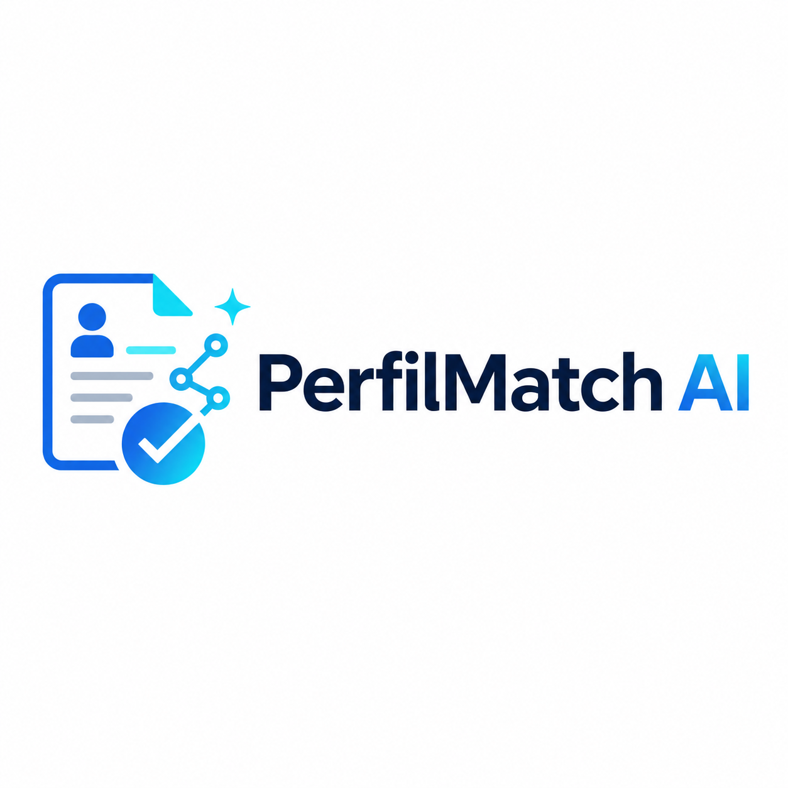

<p align="center">
  
</p>

# PerfilMatch AI

PerfilMatch AI es una aplicacion web que analiza la compatibilidad entre una hoja de vida y una descripcion de vacante. La herramienta genera un puntaje de ajuste, identifica habilidades coincidentes y faltantes, y entrega recomendaciones practicas para mejorar una candidatura.

El objetivo es ayudar a personas en busqueda de empleo a presentar mejor su perfil profesional frente a una oportunidad concreta.

## Caracteristicas

- Analisis de compatibilidad entre CV y vacante con OpenAI.
- Puntaje de ajuste visual con barra de progreso.
- Listado de habilidades coincidentes y habilidades por fortalecer.
- Recomendaciones accionables para mejorar la postulacion.
- Resumen profesional optimizado para la vacante.
- Botones para copiar resultados rapidamente.
- Interfaz responsive construida con Tailwind CSS y shadcn/ui.

## Vista General

El flujo principal es simple:

1. Pegar la hoja de vida.
2. Pegar la descripcion de la vacante.
3. Ejecutar el analisis.
4. Revisar el score, las habilidades y las recomendaciones.
5. Copiar los resultados utiles para ajustar el perfil.

## Stack Tecnologico

- Next.js 14
- React 18
- TypeScript
- Tailwind CSS
- shadcn/ui (https://ui.shadcn.com/docs/installation)
- React Hook Form
- Zod
- OpenAI API
- Sonner
- Lucide React

## Assets

Los recursos visuales principales estan en la carpeta `public`:

- Logo: `public/PerfilMatchAI-logo.png`
- Favicon: `public/Favicon-PerfilMatchAI.png`

El logo se usa en la pantalla principal de la app y en este README. El favicon esta configurado desde la metadata de Next.js.

## Requisitos

- Node.js 18 o superior
- npm
- Una API key de OpenAI

## Instalacion

Clona el repositorio e instala las dependencias:

```bash
npm install
```

Crea un archivo `.env` en la raiz del proyecto:

```bash
OPENAI_API_KEY=tu_api_key_de_openai
```

Inicia el servidor de desarrollo:

```bash
npm run dev
```

Abre `http://localhost:3000` en el navegador.

## Scripts Disponibles

```bash
npm run dev
```

Ejecuta la app en modo desarrollo.

```bash
npm run build
```

Genera la version optimizada para produccion.

```bash
npm run start
```

Ejecuta la version de produccion despues de compilar.

```bash
npm run lint
```

Ejecuta las reglas de lint configuradas para Next.js.

## Estructura Principal

```text
src/
  app/
    api/analyze/route.ts
    layout.tsx
    page.tsx
  components/ui/
  lib/
public/
  PerfilMatchAI-logo.png
  Favicon-PerfilMatchAI.png
```

## Variables de Entorno

| Variable | Descripcion |
| --- | --- |
| `OPENAI_API_KEY` | Clave usada por la ruta `/api/analyze` para llamar a OpenAI. |

## Estado del Proyecto

Proyecto inicial funcional para analizar CVs contra vacantes y presentar resultados estructurados con IA.

## Licencia

© 2024 PerfilMatch AI. Todos los derechos reservados.

El código fuente y contenido de este repositorio son propiedad exclusiva. No se permite la reproducción total o parcial, distribución o modificación sin autorización previa y por escrito.
